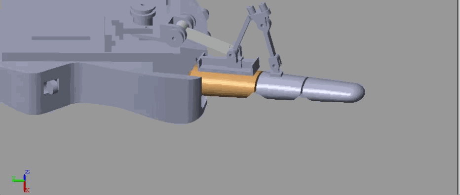

# Hand-Exoskeleton Design, Modeling and Optimization
This repository presents the design and modeling of a **rehabilitation hand exoskeleton** aimed at restoring finger movements in post-stroke patients. It includes comprehensive kinematic and dynamic analysis of both the human hand fingers and the proposed design of the exoskeleton. The CAD design was conducted using **SolidWorks** and then exported to **MATLAB**, and the simulation was conducted with  **Simscape**.The repositpry also combines **manipulability** analysis and optomization using **Genetic Algorithms** to achive safety in human-robot interaction.

  

## Key Contributions

**Mechanical Design**: Develop a lightweight,, self-alignment hand exoskeleton compatible with natural hand anatomy with integrated safty and rehabilitaion ascpect.

**Mathematical Modeling**: Develope accurate kinematic and dynamic models for both human hand and exoskeleton systems. 

**Performance Optimization**: Analyze kinematic and dynamic manipulability to ensure best force transmission and safe movements within the boundary of human hand range of motion.

## Abbreviations 

**DIP**_Distal Inter-Phalangeal  **HES**_Hand Exo-Skeleton **MCP**_Meta-Carpo-Phalangeal  **P**_Prismatic joint  **PIP**_Proximal Inter-Phalangeal   **R**_Revolute joint  **ROM**_Range of Motion 

##  System Architecture
 ### 1. Human Hand Modeling
  - 5 digits, anatomically accurate DOF

  - Full ROM constraints, intra-finger & inter-finger coupling

  - DH-based kinematics and Euler-Lagrange dynamics

  - Stiffness & damping modeling for impaired joints

  
  

### 2. Exoskeleton Design
<table style="width: 100%; border: none; border-collapse: collapse;">
  <tr>
    <!-- Left cell for table -->
    <td style="border: none; padding-right: 20px; vertical-align: top; width: 50%;">
      <table style="border: 1px solid #ddd; border-collapse: collapse; width: 100%;">
        <tr>
          <th style="border: 1px solid #ddd; padding: 10px; text-align: left; background-color: #f2f2f2;">Joint</th>
          <th style="border: 1px solid #ddd; padding: 10px; text-align: left; background-color: #f2f2f2;">Mechanism</th>
          <th style="border: 1px solid #ddd; padding: 10px; text-align: left; background-color: #f2f2f2;">Function</th>
        </tr>
        <tr>
          <td style="border: 1px solid #ddd; padding: 10px;"><strong>MCP</strong></td>
          <td style="border: 1px solid #ddd; padding: 10px;">P3RP2R closed chain</td>
          <td style="border: 1px solid #ddd; padding: 10px;">Flex/Ext + Abd/Add</td>
        </tr>
        <tr>
          <td style="border: 1px solid #ddd; padding: 10px;"><strong>PIP</strong></td>
          <td style="border: 1px solid #ddd; padding: 10px;">4R closed chain</td>
          <td style="border: 1px solid #ddd; padding: 10px;">Flex/Ext</td>
        </tr>
        <tr>
          <td style="border: 1px solid #ddd; padding: 10px;"><strong>DIP</strong></td>
          <td style="border: 1px solid #ddd; padding: 10px;">Biomechanically coupled</td>
          <td style="border: 1px solid #ddd; padding: 10px;">Passive</td>
        </tr>
      </table>
    </td>
    
    <!-- Right cell for image -->
    <td style="border: none; vertical-align: middle; width: 50%; text-align: center;">
      
    </td>
  </tr>
</table>

| Joint                       | Mechanism         | Function          |
| ---------------------------- | ------------- | --------------------- |
| **MCP**                     | P3RP2R closed chain    |	Flex/Ext + Abd/Add       |
| **PIP**                   | 4R closed chain        | closed chain	Flex/Ext        |
| **DIP**                | 	Biomechanically coupled | Passive        |

  </td>
<td>
  
</td>

## Modeling and Analysis

### Kinematic and Dynamics
**DH Parameters:** Complete tables for human fingers and exoskeleton joints

**Transformation Matrices:** Homogeneous transformations for position/orientation

**Inverse Kinematics:** Geometric methods with physiological angle constraints

**Loop Closure Equations:** For MCP and PIP closed-chain mechanisms

## Dynamic Analysis
**Energy Formulations:** Kinetic, potential (gravitational + elastic), and dissipation

**Motion Equations:** Euler-Lagrange derivation with joint torques

**Virtual Work Principle:** Force/torque transmission analysis

**Manipulability Measures:** Local and global kinematic/dynamic performance metrics

**The developed CAD model of the human hand** 

  
  

**The CAD model of the hand exoskeleton showing the design for the MCP and PIP closed-loop chains**

  

## Manipulability Evaluation
Manipulability measures how well the exoskeleton can move and apply force to the finger.

High manipulability **→** smoother motion , lower motor torque and safer rehabilitation. 
The optimizatipon of link ligth is done using **Genetic algorithms**guided by manipulability analysis. 

**Optimization Results**

| MCP Chain(mm)                       | PIP Chain(mm)          |
| ---------------------------- | ------------- |
| L1=11.33                     | L7=30    |
| L2=19.61                   | L8=30        | 
| L3=41.83               |       | 
| L4=17.4               | 	 | 

